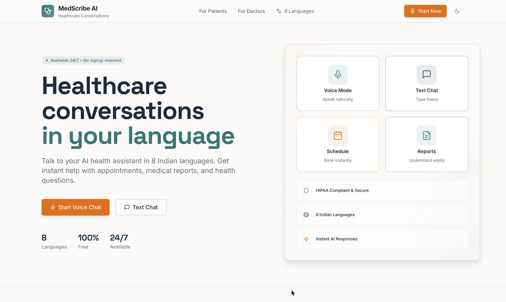
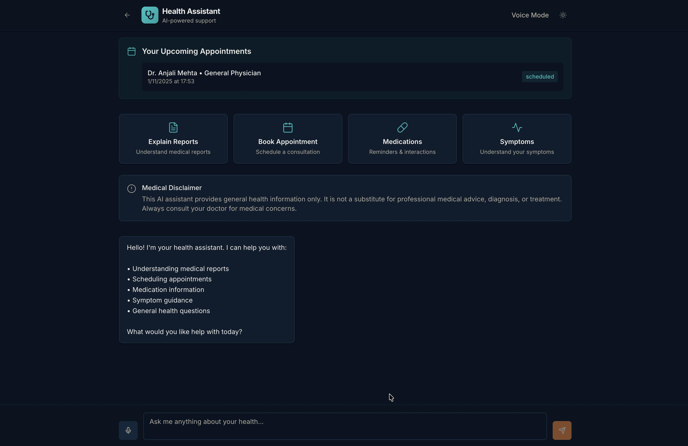
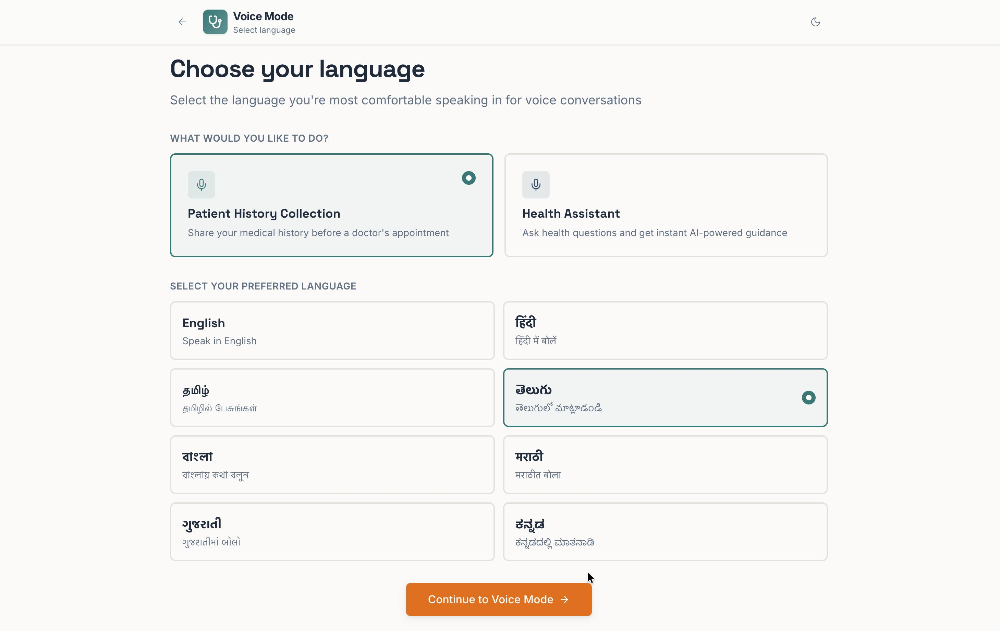
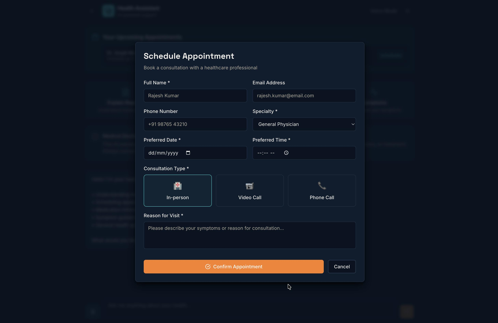

# MedScribe AI 🏥

> **AI-Powered Healthcare Communication Platform for India**  
> Breaking language barriers in healthcare with voice-first AI assistance

[](https://nextjs.org/)
[](https://www.typescriptlang.org/)
[](https://tailwindcss.com/)
[](LICENSE)

## 🎯 Problem Statement

India faces a critical healthcare communication gap:
- **Language barriers** prevent effective doctor-patient communication
- **Documentation burden** reduces time doctors spend with patients
- **Limited access** to healthcare information in regional languages
- **Pre-consultation inefficiency** leads to longer wait times

## 💡 Our Solution

MedScribe AI is a comprehensive healthcare communication platform that:

### For Doctors 👨‍⚕️
- **Smart Documentation**: Auto-generate SOAP notes, prescriptions, and medical records from consultations
- **Pre-Consultation Insights**: Review AI-collected patient histories before appointments
- **Appointment Management**: Streamlined scheduling and patient tracking
- **Voice Transcription**: Real-time consultation recording with speaker diarization

### For Patients 👥
- **Voice-First Interface**: Speak naturally in your preferred language
- **8 Indian Languages**: English, Hindi, Tamil, Telugu, Bengali, Marathi, Gujarati, Kannada
- **Health Assistant**: Get instant answers about symptoms, medications, and reports
- **Easy Scheduling**: Book appointments through conversational AI
- **Pre-Consultation History**: Share your medical history before visiting the doctor

## 🛠️ Tech Stack

### Frontend
- **Framework**: Next.js 14 with App Router
- **Language**: TypeScript
- **Styling**: Tailwind CSS + shadcn/ui components
- **Animations**: Framer Motion
- **Icons**: Lucide React

### AI & Voice
- **LLM**: Groq API (Llama 3.3 70B) - Fast, free inference
- **Speech-to-Text**: Web Speech API (Browser-native)
- **Text-to-Speech**: Web Speech Synthesis API
- **Voice Recognition**: Multi-language support with Indian accents

### State & Storage
- **State Management**: Zustand + React Context
- **Data Persistence**: Local Storage (demo mode)
- **Form Handling**: React Hook Form + Zod validation

## 🚀 Quick Start

### Prerequisites
- Node.js 18+ installed
- npm or yarn package manager
- Modern browser with Web Speech API support (Chrome, Edge recommended)

### Installation

1. **Clone the repository**
```bash
git clone https://github.com/yourusername/medscribe-ai.git
cd medscribe-ai
```

2. **Install dependencies**
```bash
npm install
```

3. **Set up environment variables**
```bash
cp .env.example .env.local
```

Add your API keys to `.env.local`:
```env
GROQ_API_KEY=your_groq_api_key_here
```

> Get your free Groq API key at [console.groq.com](https://console.groq.com/)

4. **Run the development server**
```bash
npm run dev
```

5. **Open in browser**

Navigate to [http://localhost:3000](http://localhost:3000)

### First Time Setup

1. Allow microphone permissions when prompted
2. Select your preferred language
3. Choose your role (Doctor or Patient)
4. Start exploring!

## 📁 Project Structure

```
medscribe-ai/
├── app/
│   ├── page.tsx                    # Landing page
│   ├── doctor/
│   │   ├── page.tsx               # Doctor dashboard
│   │   └── consultation/          # Consultation recording
│   ├── patient/
│   │   ├── assistant/             # Health assistant chat
│   │   ├── assistant-voice/       # Voice mode assistant
│   │   ├── history-voice/         # Voice history collection
│   │   └── select-language/       # Language selection
│   └── api/
│       ├── chat/route.ts          # AI chat endpoint
│       └── transcribe/route.ts    # Audio transcription
├── components/
│   ├── ui/                        # shadcn/ui components
│   ├── theme-provider.tsx         # Dark mode support
│   ├── theme-toggle.tsx           # Theme switcher
│   └── voice-waveform.tsx         # Voice visualizations
├── lib/
│   ├── use-voice-chat.ts          # Voice chat hook
│   ├── appointments-store.ts      # Appointment state
│   └── utils.ts                   # Utilities
└── public/                        # Static assets
```

## 🎯 Key Features

### 🎤 Voice-First Design
- Natural conversation in 8 Indian languages
- Real-time speech recognition with high accuracy
- Text-to-speech responses in the same language
- Works offline after initial load

### 🏥 Clinical Documentation
- Auto-generate SOAP notes from consultations
- ICD-10 and CPT code suggestions
- Prescription generation
- Insurance claim documentation

### 📋 Pre-Consultation History
- Conversational patient history collection
- Structured data extraction from natural language
- Review summaries before appointments
- Saves 10-15 minutes per consultation

### 🌐 Multilingual Support
- English (en-IN)
- हिंदी (hi-IN)
- தமிழ் (ta-IN)
- తెలుగు (te-IN)
- বাংলা (bn-IN)
- मराठी (mr-IN)
- ગુજરાતી (gu-IN)
- ಕನ್ನಡ (kn-IN)

### 🎨 Professional Design
- Clean, modern UI inspired by Linear and Stripe
- Fully responsive (mobile, tablet, desktop)
- Dark mode support
- Accessible (WCAG 2.1 AA compliant)
- Smooth animations and transitions

## 🔒 Privacy & Security

- **HIPAA Compliant Design**: Built with healthcare privacy in mind
- **Client-Side Processing**: Audio never leaves your device
- **No Data Storage**: Demo mode uses local storage only
- **Secure API Calls**: All AI requests encrypted in transit
- **Clear Disclaimers**: Medical advice limitations clearly stated
- **Session Management**: Automatic timeouts for security

## 🌐 Deployment

### Vercel (Recommended)

[](https://vercel.com/new/clone?repository-url=https://github.com/yourusername/medscribe-ai)

```bash
npm run build
vercel deploy
```

### Environment Variables

Set these in your deployment platform:
- `GROQ_API_KEY`: Your Groq API key


### Screenshots

**Landing Page**


**Patient Chatbot Assistant**


**Voice Mode Interface**


**Appointment Scheduling**


## 🏆 Hackathon Submission

This project was built for HackX 3.0 with the goal of improving healthcare accessibility in India through AI-powered voice interfaces.

### Team
- **Developer**: Team LocalHost ~ Jayanth Neelaiahgari
- **Role**: Full Stack Development, UI/UX Design, AI Integration

### Built With
- ⚡ Next.js 14 for blazing-fast performance
- 🎨 Professional design system (no AI-generated UI)
- 🗣️ Native browser speech APIs (no external dependencies)
- 🤖 Groq's ultra-fast LLM inference
- 🌍 Built specifically for Indian healthcare context

## 📝 License

MIT License - See [LICENSE](LICENSE) file for details

## 🙏 Acknowledgments

- Groq for providing free, fast LLM inference
- shadcn/ui for beautiful component primitives
- The open-source community for inspiration

## 📧 Contact

For questions or feedback:
- GitHub: [@jayanthwritescode](https://github.com/jayanthwritescode)

---

**Made with ❤️ for Indian Healthcare**
